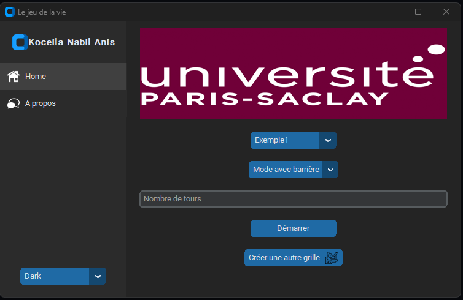

# Intro

## Installation des paquets

Pour lancer il faut installer les paquets mentionnés dans le fichier ./src/requirements.txt

```bash
cd ./src
pip install -r "./requirements.txt"
```

## Lancement de l'application (version GUI)

```bash
cd src
python ./main.py
```



## Fontionnalités :

- Possibilité de démarrer à partir d'une carte pré-configurée.
- Possibilité de créer sa propre carte.
- Possibilité de démarrer avec la version "Avec Barrière de Synchronisation" ou la version "Sans Barrière de Synchronisation".
- Possibilité de définir le nombre de tours.
- Possibilité de démarrer avec Interface Grahique ou en ligne de commande en mode **verbose**.
