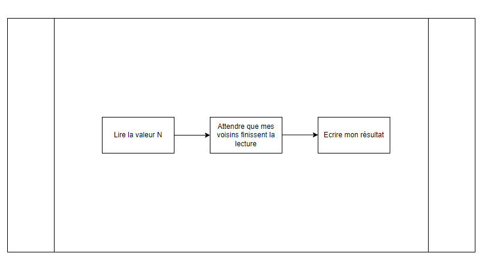

# Version sans barièrre

## Intro

Dans cette version, à chaque appel à la fonction on lance N\*N Threads pour calculer l'état N+1.

## Explication de comment les threads s'executer

Comme le montre le schéma, chaque thread récupère la valeur à l'état **N**, calcule la valeur **N+1**, attend que les voisins finissent leurs calculs et écrit la valeur N+1. 
La phase d'attente des voisins est **importante** car sinon les calculs de ces derniers seront faussés. 
Pour gérer l'attente, nous avons utilisé les **condtions** de Python **(threading.conditions)** avec une **matrice** où chaque thread peut indiquer qu'il est prêt à écrire.
