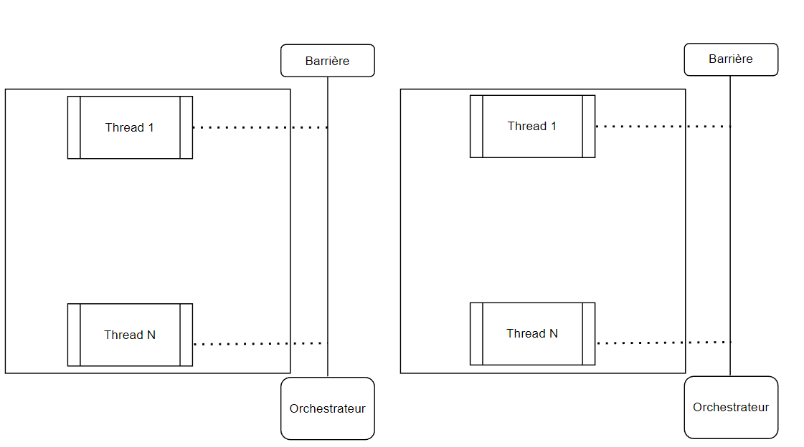

# Version avec barrière de synchronisation

## Intro

Dans cette version on lance n × n threads qui calculent en boucle l’état de leur case respective. 
Les threads sont synchronisés avec une barrière de synchronisation

## Explication

Dans cette nouvelle configuration nous avons gardé la même mécanique de fonctionnement [lecture -> attente des voisins -> écriture], cependant nous avons rajouté une barrière de synchronisation, pour s'assurer que tout les threads sont au même niveau, l'orchrestrateur est lancé à chaque fin de barrière et avant le lancement de la prochaine étape, ce qui permet de remettre les variables à leurs état initial et de lancer des callback exemple rafraichissement de l'interface ou affichage dans la console.
